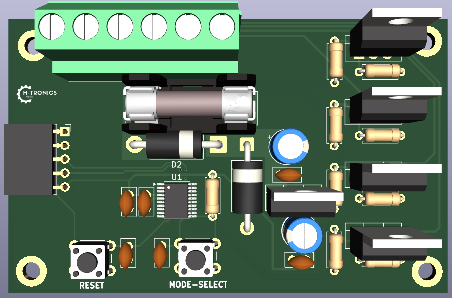
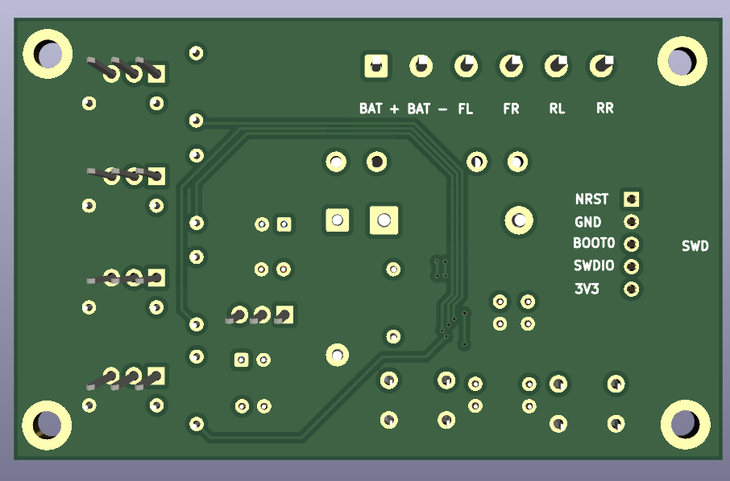
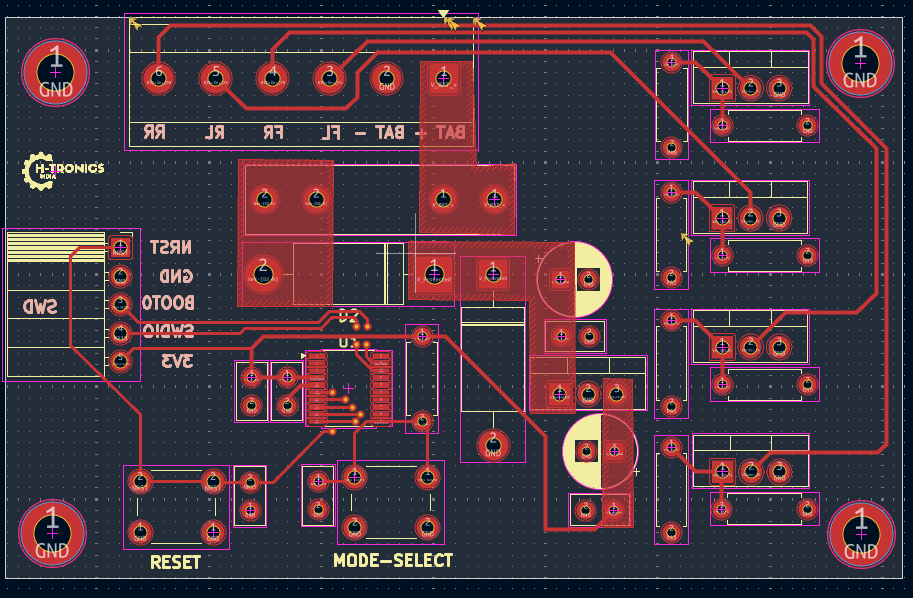
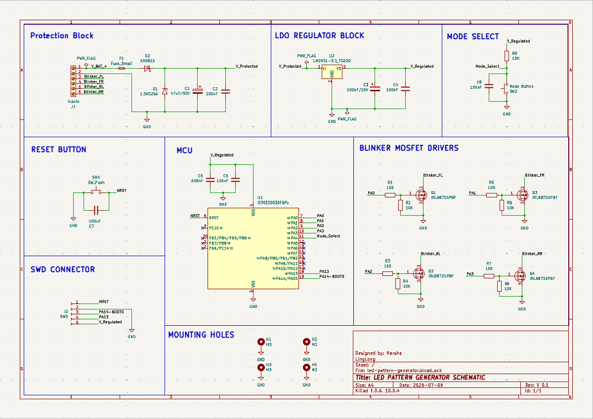

# MotoPulse

A robust, solid-state motorcycle turn signal controller powered by an STM32G0 microcontroller and high-current TO-220 MOSFETs. Built to replace unreliable mechanical flashers, this board handles heavy vehicle vibrations and features high-power thermal handling and noise isolation for automotive environments.

---

## Visuals

| 3D Render (Top) | 3D Render (Bottom) | PCB Layout |
|---|---|---|
|  |  |  |

### Schematic Diagram

---

## Features

* **Solid-State Reliability:** Swaps out clunky mechanical relays for rugged TO-220 MOSFET switching.
* **High Current Support:** Safely handles up to 3A per channel—compatible with both OEM halogen bulbs and aftermarket LEDs.
* **Automotive Protection:** Includes onboard fuse safety, reverse polarity protection diodes, and input voltage clamping.
* **Noise Isolated Design:** Employs a solid bottom-layer ground plane to block high-frequency motorcycle ignition and alternator interference.

---

## Hardware Specifications

* **Microcontroller:** STM32G030F6P6
* **Power Input:** 12V DC (Vehicle Battery)
* **Logic Voltage:** 3.3V Regulated (via dedicated onboard LDO)
* **Outputs:** 4x Independent MOSFET switched high-side channels
* **PCB Specs:** 2 Layers, 1 oz Copper, JLCPCB compatible constraints

---

